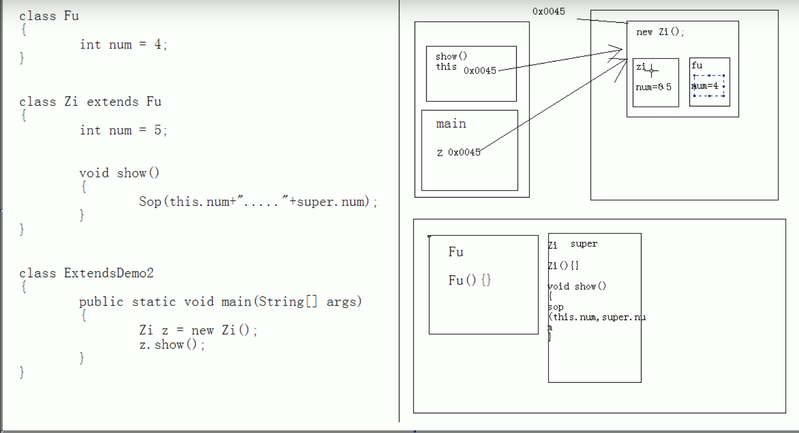

# 继承

## 好处

1. 提高了代码的复用性
2. 让类与类之间产生了联系，给多态提供了前提

## 单继承与多继承

Java支持单继承，不直接支持多继承，但对c++的多继承机制进行改良

**单继承**：一个子类只能有一个直接父类

**多继承**：
不直接支持，是因为多个父类若有相同成员，会产生方法调用的不确定性。

Java支持多层继承

就会出现继承体系

当出现一个继承体系时：
1. 查看顶层类，了解该体系的基本功能
2. 创建体系的最子类对象，完成功能的使用

## 定义继承

1. 当类之间存在所属关系时，就定义继承
所属关系： is a 关系

## 子父类之间成员变量的特点

当本类的成员变量与局部变量重名用this关键字；
当子类的成员变量与父类的成员变量重名时，用super关键字

this和super用法很相似

this：代表一个本类的引用
super：代表一个父类的空间

## 子父类成员函数的特点-覆盖

当子父类出现成员函数一摸一样的情况时，会运行子类函数，该现象称为覆盖
函数两个特性：

1. 重载，同一类中，overload
2. 覆盖，子类中，重写，override

覆盖注意事项：

1. 子类覆盖父类时，子类权限必须要大于等于父类权限
2. 静态只能覆盖静态，或被静态覆盖

### 什么时候使用覆盖操作？

当对一个类进行子类扩展时，子类需要保留父类的功能声明，
但时要定义子类该功能特有内容时，就使用覆盖

## 子父类构造函数的特点

### 子类的实例化过程

在子类构造对象时，发现，访问子类构造函数时，父类也运行了：
原因是：在子类的构造函数中第一行有一个默认的隐式语句，super（）。