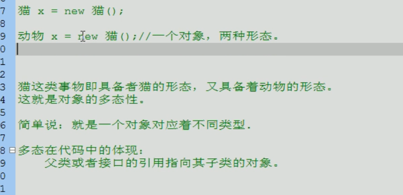
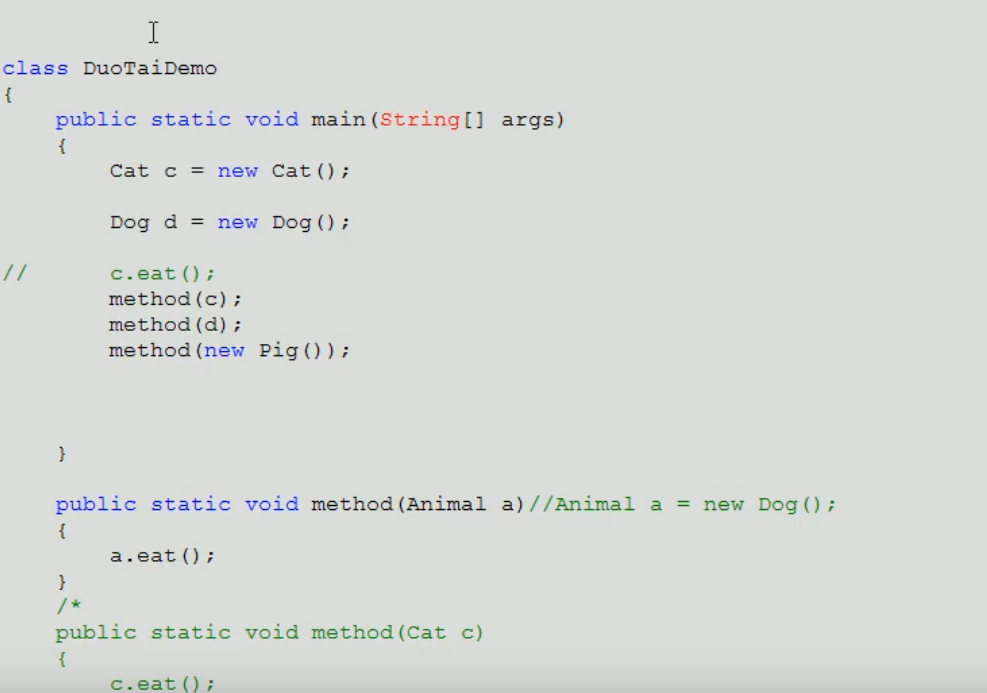
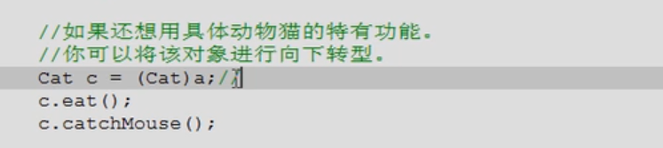
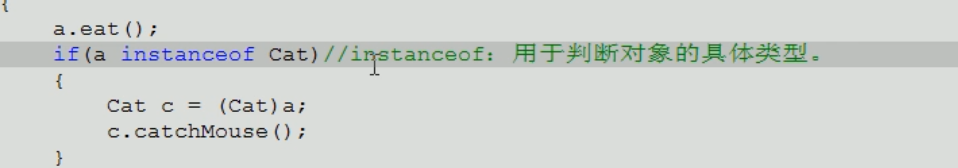
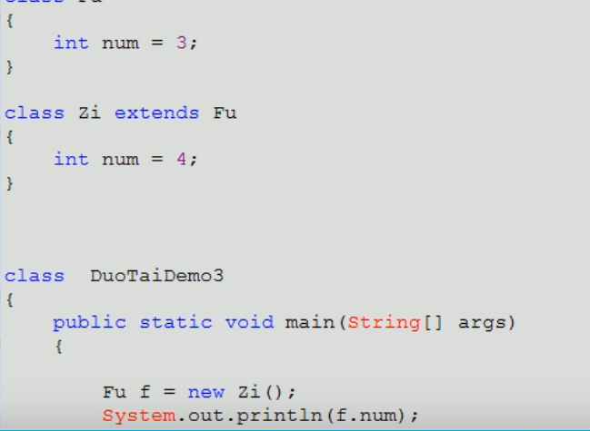
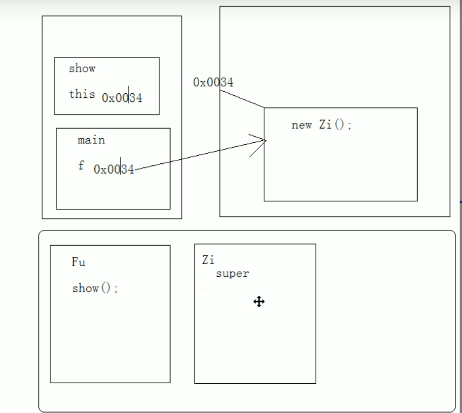

## 对象的多态性

父类或接口的引用指向其子类对象

## 多态的好处

提高了代码的扩展性，前期定义的代码可以使用后期定义的内容

## 多态弊端&前提

前期定义的内容不能使用后期定义的特有内容

前提：

1. 必须有关系，继承，实现
2. 要有覆盖

## 转型

## instanceof

用于判断对象的具体类型，只能用于引用数据类型判断
通常在向下转型前用于健壮性判断

## 成员变量

编译时：参考引用型变量所属的类中是否有调用的成员变量，有，则通过，无，则失败

运行时：参考引用型变量所属的类中是否有调用的成员变量，并运行所属类的成员变量
简单说，编译和运行都参考左边

## 成员函数

编译时：参考引用型变量所属的类中是否有调用的成员函数，有，则通过，无，则失败

运行时：参考的是对象所属的类中是否有调用的函数
简单说，编译看左边，运行看右边

## 静态函数

编译时：参考引用型变量所属的类中是否有调用的静态函数

运行时：参考引用型变量所属的类中是否有调用的静态函数
简单说，编译和运行都参考左边

对于静态函数，其实是不需要对象的
