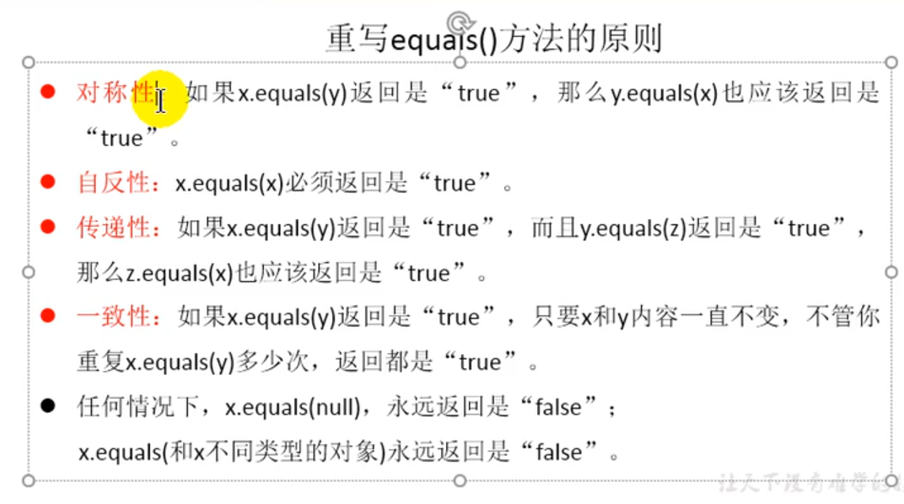

## ==

1. 基本数据类型：数值是否相等
2. 引用数据类型：引用地址是否相同

## equals()

1. 只能适用于引用数据类型，比较地址值是否相同
Object类中的定义：
```java
public boolean equals(Object obj) {
        return (this == obj);
    }
```

## equals 重写

```java

public boolean equals(Object obj) {
        if(obj == this){
            return true;
        }
        if(obj == null){
            return false;
        }
        if(obj instanceof Person){
            Person anPerson = (Person)obj;
            //比较属性是否相同
             return  this.age == anPerson.age&& this.name.equals(anPerson.name);
        }

        return false;
    }

```


## equals 与 ==区别

1. ==既可以比较基本数据类型，也可以比较引用类型；对于基本数据类型就是比较值，对于引用类型就是比较地址值
2. equals的话，它是java.lang.Object类的方法，如果该方法没有被重写，默认情况下也是 == ；我们可以看到String
   等类的equals方法是重写过的；
3. 通常情况下，会重写equals方法，来比较对象的属性值是否相等；