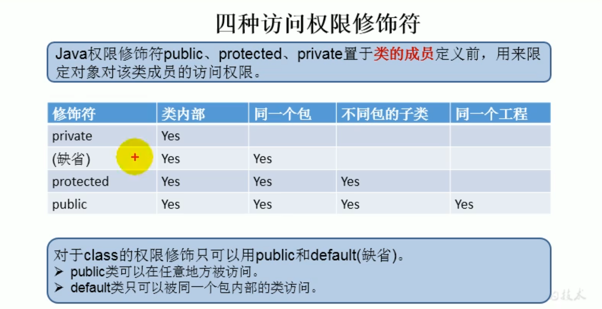

# 封装

封装：是指隐藏对象的属性和实现细节，仅对外提供公共访问接口

## 好处

1. 将变化隔离
2. 便于使用
3. 提高重用性
4. 提高安全性

## 封装原则

1. 把不需要对外提供的内容全部隐藏起来
2. 把属性都隐蔽，提供公共方法对其访问

## 权限修饰符

从小到大：private ,缺省，protected,public

这四种修饰符可以修饰类级类的内部结构：属性，方法，内部类，构造器

类：缺省 public
