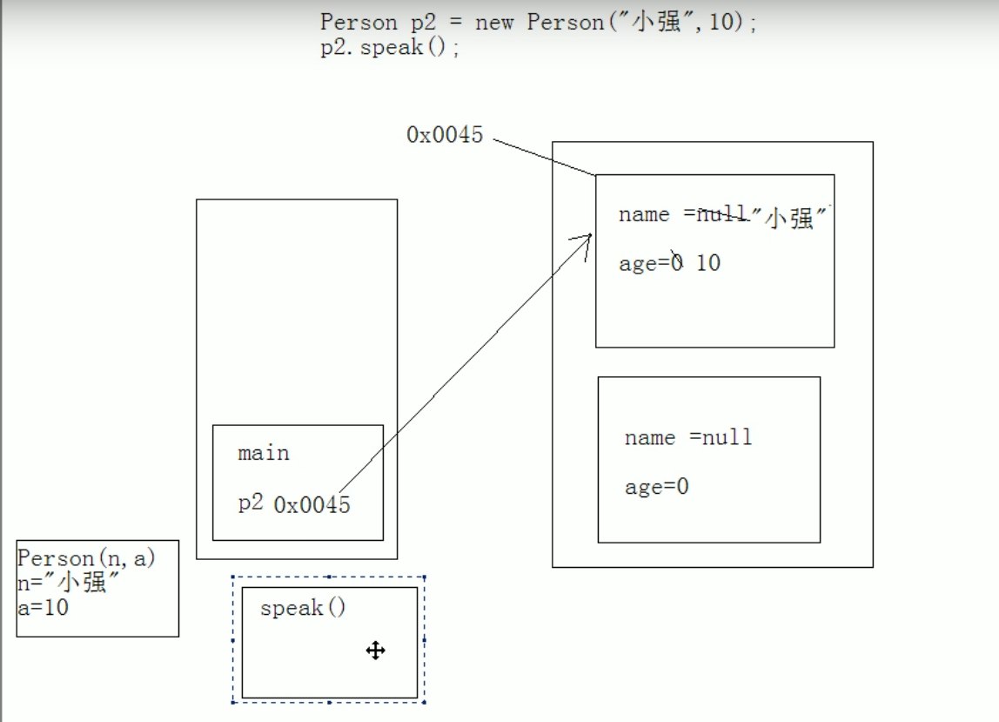

# 构造函数

## 特点

1. 函数名与类名相同
2. 不用定义返回值类型
3. 没有具体的返回值

## 作用

给对象进行初始化

## 注意

1. 默认构造函数的特点
2. 多个构造函数是以重载的形式出现的

## 默认构造函数

## 构造函数与一般函数的区别

1. 构造函数：对象创建时，就会创建与之对应的构造函数，对对象进行初始化
一般函数：对象创建后，需要函数时才会被调用

2. 构造函数：对象创建时，只调用一次
一般函数：对象创建后，可以被调用多次

## 重载

## 内存

