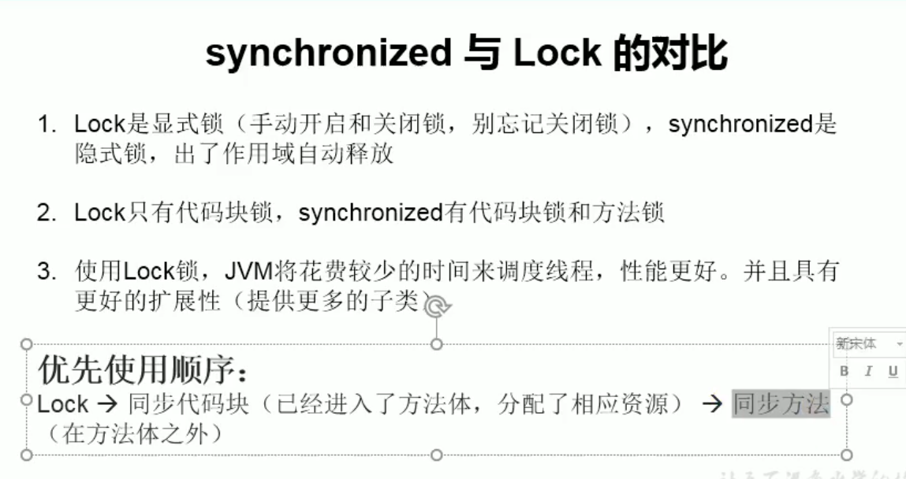

解决线程安全方式三：Lock锁

```java
import java.util.concurrent.locks.ReentrantLock;

/**
 * @ClassName:LockTest
 * @description: TODO
 * @author: OrienWsL
 * @time: 2019-11-19 21:43
 * @Version:V1.0
 */
public class LockTest {
    public static void main(String[] args) {
        Window w1 = new Window();

        Thread t1 = new Thread(w1);
        Thread t2 = new Thread(w1);
        Thread t3 = new Thread(w1);

        t1.start();
        t2.start();
        t3.start();
    }
}

class Window implements Runnable{
    private int ticket = 100;
    //1.实例化lock
    private ReentrantLock lock = new ReentrantLock(true);
    @Override
    public void run() {
        while(true){
            try{

                //2.调用lock

                lock.lock();
                if(ticket>0){
                    try {
                        Thread.sleep(100);
                    } catch (InterruptedException e) {
                        e.printStackTrace();
                    }

                    System.out.println(Thread.currentThread().getName() + "卖票；票号为"+ ticket);

                    ticket--;
                }else{
                    break;
                }
            }finally {

                //3释放锁
                lock.unlock();
            }
        }
    }
}
```

面试题：synchronized与Lock锁的不同

synchronized机制在执行完相应的代码块后，自动释放锁
lock需要手动启动同步，手动结束同步


