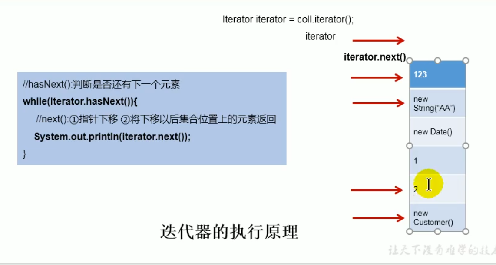
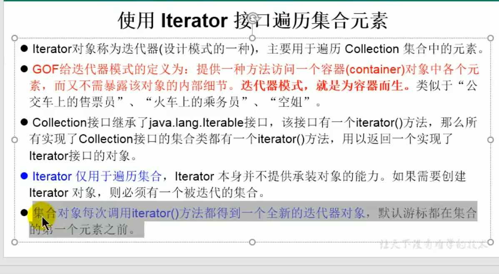
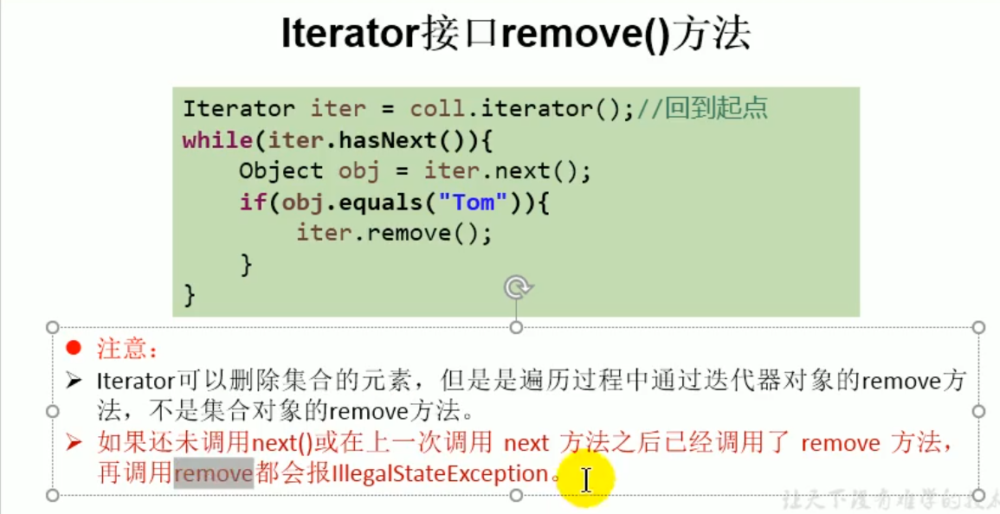

```java
 //iterator():用于遍历
        Iterator iterator = collection.iterator();
        while(iterator.hasNext()){
            Object obj = iterator.next()
            System.out.println(iterator.next());

            //Iterator.remove()
            if("aa".equals(obj)){
                iterator.remove();
            }
        }
```
