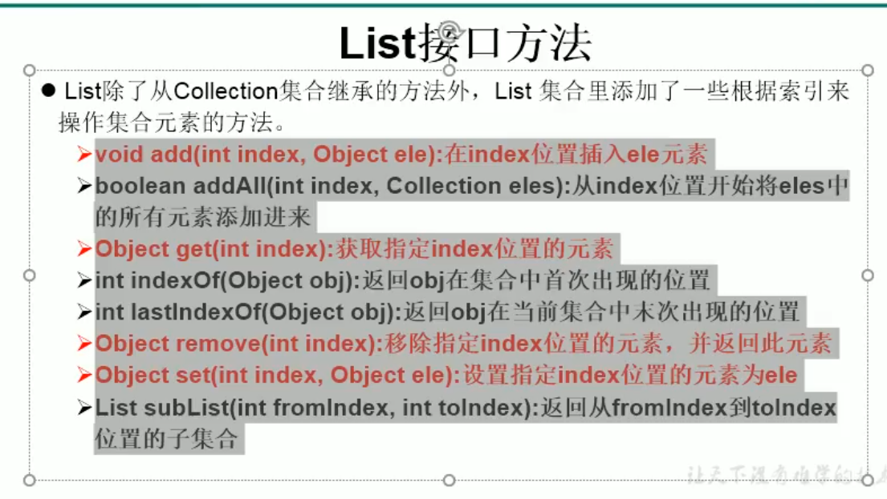

## List常用方法
```java
 ArrayList list = new ArrayList();

        list.add(123);
        list.add("aa");
        System.out.println(list);

        //add(index,obj)
        list.add(2,new Date());

        //addAll(index,collection)
        List integers = Arrays.asList(1, 2, 3);
        list.addAll(2,integers);
        System.out.println(list.size());

        //indexOf()
        int aa = list.indexOf("aa");
        System.out.println(aa);

        //lastIndexOf()
        int i = list.lastIndexOf(2);

        //Object remove(index)
        Object remove = list.remove(3);
        System.out.println(remove);

        //set(index,Object)
        Object cc = list.set(3, "CC");

        //subList(from,end)
        List list1 = list.subList(2, 4);
        System.out.println(list1);
```

## List遍历

1. Iterator
2. for循环