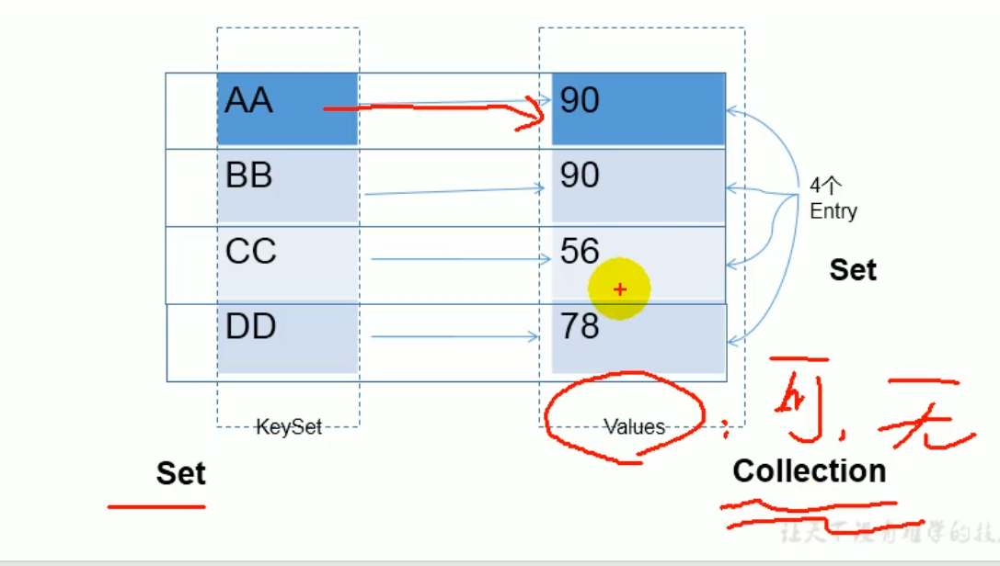

Map:双列数据，存储key-value
    ---HashMap:作为Map的主要实现类；线程不安全，效率高；可以存储null的key和value
        ---LinkedHashMap：保证在遍历Map同时，可以按添加顺序遍历；
        原因：在原有HashMap的基础上，添加了一对指针，指向前后的节点；
        对于频繁的遍历操作，效率高于HashMap
    ---HashTable：Map的古老实现类；线程安全，效率低；不可以存储null的key和value
        ---Properties：主要用来处理配置文件
    ---TreeMap:按照添加的key-value排序，实现排序遍历；此时考虑key的自然排序；
    底层是红黑树

## Map存储key-value的特点

key所在的类要重写equals和hashCode方法