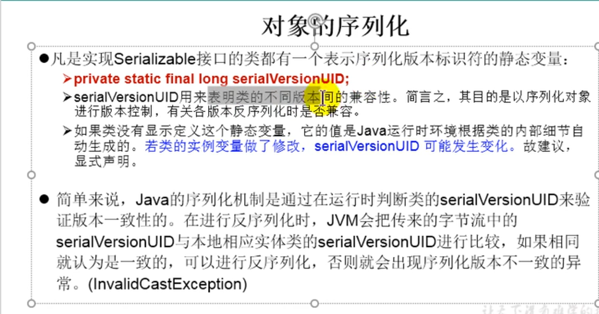

序列化：使用ObjectOutputStream类保存基本数据类型或者对象的机制
反序列化：使用ObjectInputStream类读取基本数据类型或者对象的机制

不能序列化static和transient修饰的变量


```java
//序列化
        ObjectOutputStream oos = new ObjectOutputStream(new FileOutputStream("object.dat"));

        oos.writeObject(new String("我爱你中国"));
        oos.flush();
        oos.close();

        //反序列化
        ObjectInputStream ois = new ObjectInputStream(new FileInputStream("object.dat"));

        Object o = ois.readObject();

        String str = (String)o;
        System.out.println(str);
        ois.close();
```

## 自定义类的序列化

要求：
1. 类必须实现Serializable接口
2. 必须定义serialVersinID;
3. 自定义类中使用的其他类也需可序列化的


