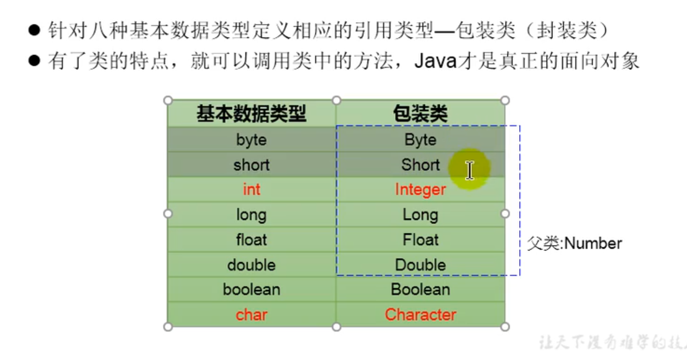
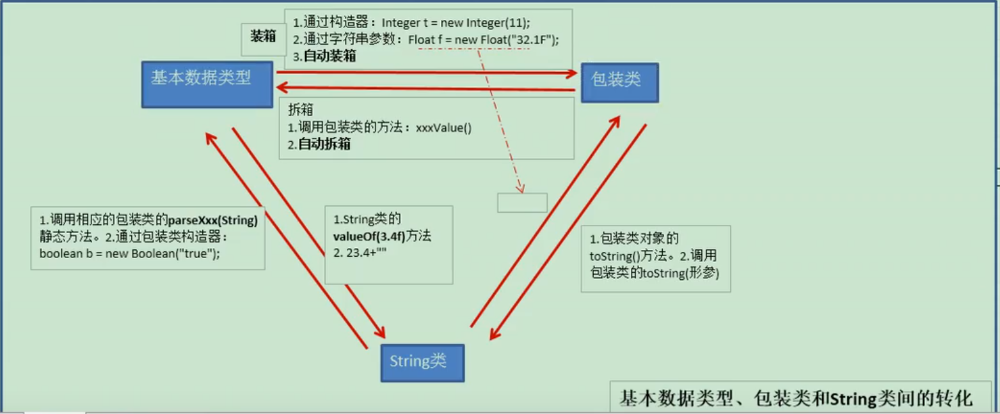

```java
import org.junit.Test;

/**
 * @author OrienWsL
 */
public class WrapperTest {
    /**
    * @Description:  基本数据类型转换为包装类，调用包装类的构造器
    * @Param: []
    * @return: void
    * @Author: OrienWsL
    * @Date: 2019-11-14
    */
    @Test
    public void test1(){
        int num1 =  10;
        Integer integer = num1;
        System.out.println(integer);

        Integer integer1 = Integer.parseInt("123");
        System.out.println(integer1);
    }
    /** 
    * @Description: 包装类转换为基本数据类型 ，调用包装类的xxxValue;
    * @Param: [] 
    * @return: void 
    * @Author: OrienWsL
    * @Date: 2019-11-15 
    */ 
    public void test2(){
        Integer integer = 123;
        int int1 = integer.intValue();
    }

}
```