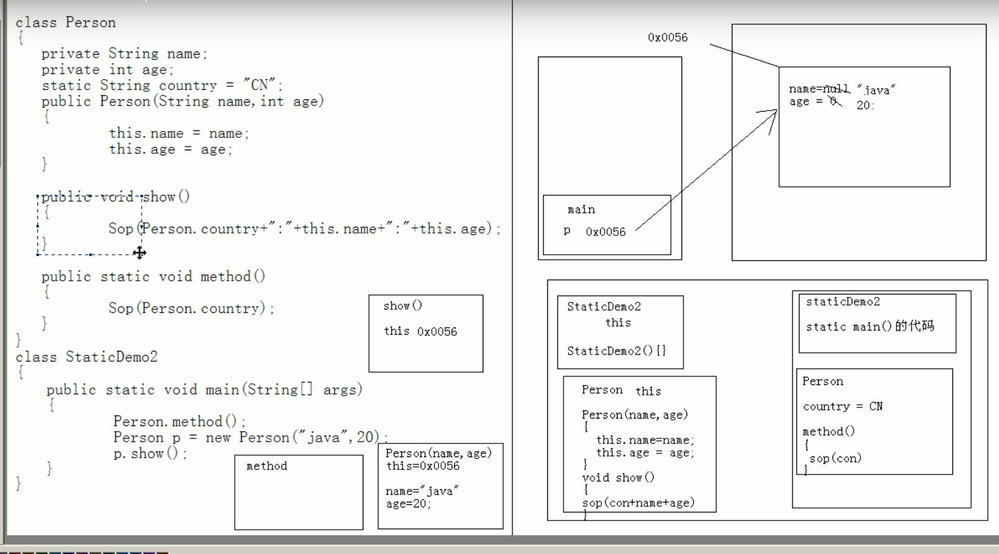

# static关键字

用于修饰成员

## 被修饰后的成员具备以下特点

1. 随着类的加载而加载
2. 优先于对象而存在
3. 被所有对象共享
4. 可以直接被类名调用

## 成员变量与静态变量的区别

1. **生命周期不同**：成员变量随着对象的创建而存在，随着对象的回收而释放；静态变量随着类的加载而加载，随着类的消失而消失
2. **调用方式不同：**成员变量只能被对象调用；静态变量既可以被对向调用，也可以被类调用。
3. **别名**：成员变量也成为实例变量；静态变量也称为类变量
4. **数据存储位置不同：**成员变量存储在堆内存的对象中，所以也叫作对象的特有数据；静态变量存储在方法区（共享数据区）的静态区，所以也叫作对象的共享数据。


## 注意

1. 静态方法只能访问静态成员
2. 静态方法中不可以使用this，super
3. 主函数是静态的

## main函数

### 特殊之处

1. 格式是固定的
2. 被jvm识别和调用
public：因为权限必须是最大的
static：不需要对象
void：主函数没有具体的返回值
String[] args:是主函数识别的参数列表，字符串数组

## static内存图解


## 什么时候使用static？

1. 静态变量
   当分析对象中所具备的成员变量的值都是相同的


2. 静态函数
   分析函数是否需要访问特殊数据;访问静态变量是需要static；不访问成员变量是需static

## 静态代码块

```java
static{

}
```

随着类的加载而执行，而且只执行一次
作用：对类进行初始化