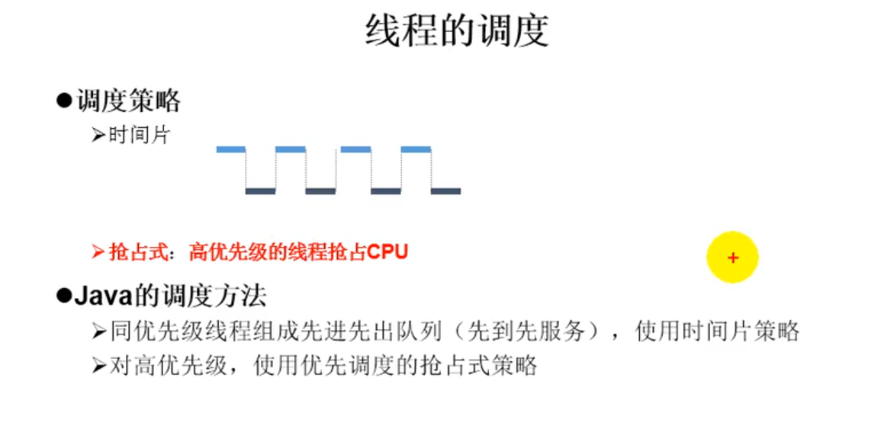

```java
/*
1. 创建一个Thread的子类
2. 重写run方法
3. 创建子类对象
4.通过此对象调用start（）；
*/

//问题一：我们不能通过直接调用run方法启动线程
//问题二：已经调用start（）方法的线程，不可以再开启一个线程
public class ThredTest {
    public static void main(String[] args) {
        System.out.println("hello");

    }
}
```

## 线程的常用方法


```java
/**
 * @ClassName:ThredTest
 * @description: TODO
 * @author: OrienWsL
 * @time: 2019-11-16 20:15
 * @Version:V1.0
 */

public class ThreadTest {
    public static void main(String[] args) {
        MyThread t1 = new MyThread("Thread@1");
        //t1.setName("线程一");
        t1.start();

        //给主线程命名
        Thread.currentThread().setName("主线程");
        for(int i =0;i<100;i++){
            try {
                Thread.sleep(1000);
            } catch (InterruptedException e) {
                e.printStackTrace();
            }
            if(i%2==0){
                System.out.println(Thread.currentThread().getName() + ":"  + i);
            }

            if(i==20){
                try {
                    t1.join();
                } catch (InterruptedException e) {
                    e.printStackTrace();
                }

            }
        }

    }
}

class MyThread extends Thread{
    //1.currentThread():静态方法，返回当前代码正在执行的线程
    //2.getName():获取当前线程的名字
    //3.setName():设置当前线程的名字
    //4.yield():释放当前cpu的执行权
    //5.join():在线程a中调用线程b的join()方法时，线程a就进入阻塞状态，当线程b完全执行完成后，线程a才解除阻塞
    //6stop():强制结束线程，不推荐
    //7.sleep():
    //8.isAlive()：判断线程是否存活

    @Override
    public void run() {
        for(int i =0;i<100;i++){
            try {
                sleep(1000);
            } catch (InterruptedException e) {
                e.printStackTrace();
            }
            if(i%2==0){
                System.out.println(Thread.currentThread().getName() + ":"  + i);
            }

            if(i%20==0){
                yield();
            }
        }
    }

    public MyThread(String name){
        super(name);
    }
}
```

## 线程优先级设置



```java
//设置分线程的优先级
        //说明：高优先级的线程会抢占低优先级线程的CPU，一旦抢占成功，就会执行
        t1.setPriority(10);
        t1.start();
```