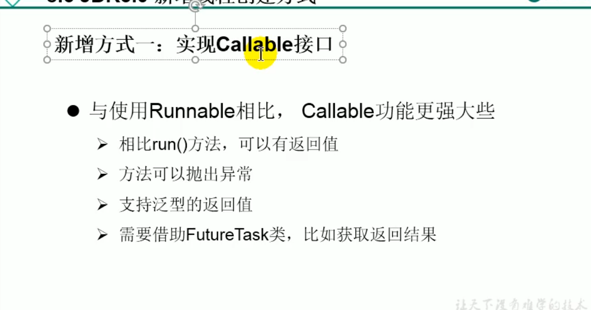
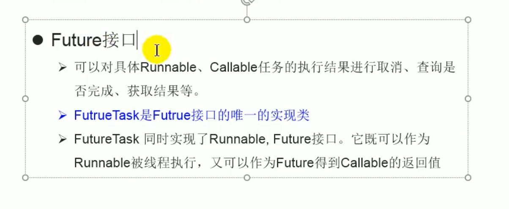

1. 创建一个实现Callable接口的实现类
2. 实现call（），将此线程需要执行的操作声明在call（）中
3. 创建Callable接口实现类的对象
4. 将此对象传递到FutureTask的构造器中，创建FutureTask的对象
5. 将FutureTask的对象传递到Thread类的构造器中，创建Thread类的对象，并调用start()
6. 获取call（）返回值

## 如何理解实现Callable接口比Runnable接口强大

1. call() 可以有返回值
2. call（）可以抛异常，可以获取异常
3. Callable支持泛型