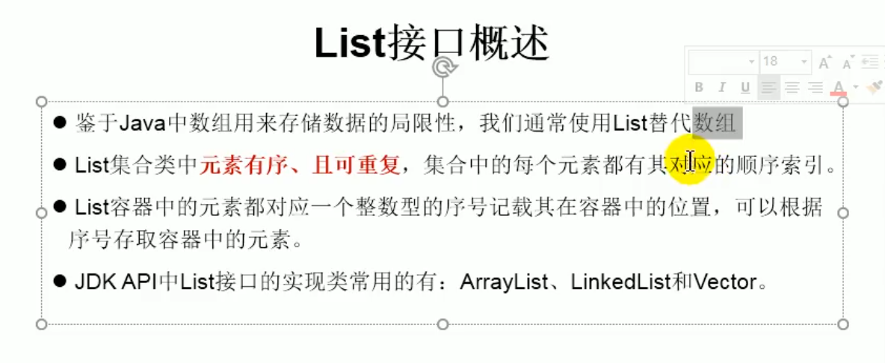

动态数组

ArrayList,LinkedList,Vector的异同

同：都实现了List接口，存储数据的特性相同：存储有序的，可重复的数组

异：ArrayList:作为List接口的主要实现类；线程不安全，效率高；底层用Object[]
    LinkedList:适用于频繁的插入，删除操作；底层为双向链表
    Vector: 作为List的古老接口；线程安全，效率低；底层Object[]