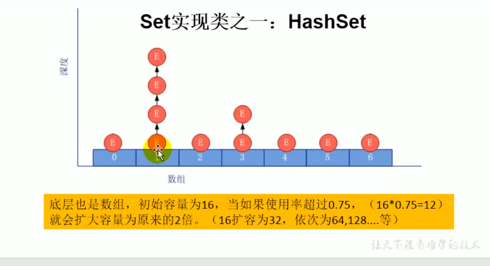

## HashSet的添加过程
以a为例：
首先调用a的hashCode（），计算a的哈希值，
此哈希值接着通过某种算法计算出a在HashSet中的位置，判断数组位置上是否有其他元素：
如果无，则添加；
如果有，比较哈希值，如果不相同，则添加；
若相同，则调用a的equals方法：
    为true，失败
    为false，成功；此时以链表的形式存储

**要求**
1. Set中添加对象，一定要实现equals和hashCode
2. 重写的equals的hashCode尽可能保持一致性；相同的对象哈希值一定相等

