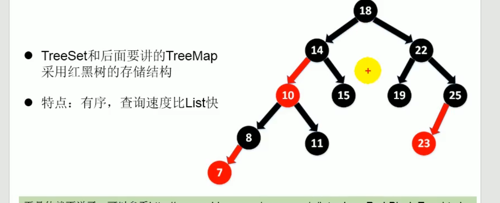

1. TreeSet类添加的数据必须是相同类型

## treeSet的自然排序
对象需要实现Comparable接口方法compareTo



## 定制排序
Comparator
```java
Comparator comparator = new Comparator() {
            @Override
            public int compare(Object o1, Object o2) {
                if(o1 instanceof Person && o2 instanceof Person){
                    Person p1= (Person)o1;
                    Person p2 = (Person)o2;
                    return Integer.compare(p1.getAge(),p2.getAge());
                }else{
                    throw new RuntimeException("操你妈");
                }
            }
        };
        TreeSet treeSet = new TreeSet();
        treeSet.add(new Person("Tom",12));
        treeSet.add(new Person("Jack",13));
        treeSet.add(new Person("Tom",23));
```